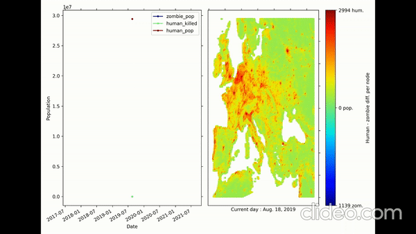

# Zombies Spread Dynamics

[![Contributors][contributors-shield]][contributors-url]
[![Forks][forks-shield]][forks-url]
[![Stargazers][stars-shield]][stars-url]
[![Issues][issues-shield]][issues-url]
[![MIT License][license-shield]][license-url]
<!-- [![LinkedIn][linkedin-shield]][linkedin-url] -->


<!-- PROJECT LOGO -->
<br />
<p align="center">
  <a href="https://github.com/Johansmm/zombies-spread-dynamics">
    
  </a>

  <h3 align="center"> Zombie Spread Dynamics </h3>

  <p align="center">
    Simulation of the spread of a zombie epidemic in Europe, based on the modeling of the territory with graph theory, in order to take control measures with military troops and nuclear bombs to save the largest possible population.
    <br />
    <a href="docs"><strong>Explore the docs »</strong></a>
    <br />
    <br />
    <a href="https://github.com/Johansmm/zombies-spread-dynamics/blob/Main/demo.mp4">View Demo</a>
    ·
    <a href="https://github.com/Johansmm/zombies-spread-dynamics/issues">Report Bug</a>
    ·
    <a href="https://github.com/Johansmm/zombies-spread-dynamics/issues">Request Feature</a>
  </p>
</p>


<!-- TABLE OF CONTENTS -->
<details open="open">
  <summary><h2 style="display: inline-block">Table of Contents</h2></summary>
  <ol>
    <li>
      <a href="#about-the-project">About The Project</a>
      <ul>
        <li><a href="#built-with">Built With</a></li>
      </ul>
    </li>
    <li>
      <a href="#getting-started">Getting Started</a>
      <ul>
        <li><a href="#prerequisites">Prerequisites</a></li>
        <li><a href="#installation">Installation</a></li>
      </ul>
    </li>
    <li><a href="#usage">Usage</a></li>
    <li><a href="#roadmap">Roadmap</a></li>
    <li><a href="#contributing">Contributing</a></li>
    <li><a href="#license">License</a></li>
    <li><a href="#contact">Contact</a></li>
    <li><a href="#acknowledgements">Acknowledgements</a></li>
  </ol>
</details>

<!-- ABOUT THE PROJECT -->
## About The Project
We find ourselves in an apocalyptic world plagued by zombies, whose origin happened on August 18, 2019 in the city of [Rize, Turkey](https://fr.wikipedia.org/wiki/Rize). According to studies, the dynamics of zombie behavior has been modeled based on the geography of the terrain and the surrounding human population density. For this, digital image processing and graph theory techniques are used to transform maps of the European continent into a graph, with population information at each node. 

Subsequently, the implementation of the dynamics is carried out, creating maps that simulate the propagation. Finally, 2 epidemic control action measures are executed, which involve the deployment of military troops and nuclear bombs, affecting the behavior of specific nodes in the network. All this in order to save as much of the remaining population as possible!

For more information, you can see the [description of the project](docs/description.pdf).

### Built With
* [python](https://rasa.com/)
* [networkx](https://networkx.org/)
* [matplotlib](https://matplotlib.org/)
* [opencv](https://opencv.org/)

<!-- GETTING STARTED -->
## Getting Started
To get a local copy just executed the following command:
Activate environment
```sh
git clone https://github.com/Johansmm/zombies-spread-dynamics.git
```

### Prerequisites
Install all the requerements:
```sh
pip3 -m install -U -r requerements.txt
```

<!-- USAGE EXAMPLES -->
## Usage
The project was developed in three parts:
1. Modeling of the graph through geographic images of Europe.
2. Propagation dynamics implementation
3. Execution of set of actions (military troops and nuclear bombs)

The development of all the steps are consigned in our **main notebook**. For the dynamics step, we implemented a python library that allows to execute the propagation step by step. To use it, we must import the library and create an object of type **spread_zombie_dynamics**. This will require to previously define the network configuration to be used and the propagation start date. As a test, you can use a grid defined in the same library:

```python
from libraries.dynamics import spread_zombie_dynamics as szd
from libraries.dynamics import graph_by_default
import datetime as dt
import tqdm

G = graph_by_default(nodes = 20)
ini_date = dt.datetime(year = 2019, month = 8, day = 18)
dynamic = szd(graph = G, INTIAL_DATE = ini_date)
```

* **Note:** The nodes and edges of the network must contain certain attributes. You can check which ones in the library information.

To run through a cycle of the simulation, just execute the **step()** method, this will propagate the initial zombies to their neighboring cells and perform the interactions between zombies and humans according to the propagation rules. Thus, the command allows iterative execution of the algorithm:

```python
for epoch in tqdm.tqdm(range(20)): # Just 20 epochs
    dynamic.step() # Run one step in dynamic procedure
    print(G) # See basic statistics at each iteration
```

You can see how the graph changes through the simulation from different functions.  

```python
kind_plot = 'evolution' # Change the word in order to get a different plot
graph_type = 'both' # Available types: ['zombie','human', 'both']
for epoch in tqdm.tqdm(range(20)): # Just 20 epochs
    dynamic.step() # Run one step in dynamic procedure
    dynamic.plot_zombie_age() # Zombies evolution by age
    if kind_plot == 'evolution':
        dynamic.plot_evolution() # Zombies and human evolution
    elif kind_plot == 'graph':
        dynamic.plot_graph(type = graph_type) # Graph evolution
    elif kind_plot == 'all':
        dynamic.plot_all(type = graph_type) # Population + Graph evolution
    print(G) # See basic statistics at each iteration
plt.show()
```
* **Note:** For complex networks with more than 400 total nodes, these simulations can be computationally expensive. It is recommended to update the graph every few iterations.

For more information, use the *help* command to view the library documentation. Moreover, you can see the results obtained in the project in the [final report](docs/report.pdf). 

<!-- ROADMAP -->
## Roadmap

See the [open issues](https://github.com/Johansmm/zombies-spread-dynamics/issues) for a list of proposed features (and known issues).


<!-- CONTRIBUTING -->
## Contributing

Contributions are what make the open source community such an amazing place to be learn, inspire, and create. Any contributions you make are **greatly appreciated**.

1. Fork the Project
2. Create your Feature Branch (`git checkout -b feature/AmazingFeature`)
3. Commit your Changes (`git commit -m 'Add some AmazingFeature'`)
4. Push to the Branch (`git push origin feature/AmazingFeature`)
5. Open a Pull Request

<!-- LICENSE -->
## License

Distributed under the MIT License. See `LICENSE` for more information.


<!-- CONTACT -->
## Contact
* Johan Mejia (johan-steven.mejia-mogollon@imt-atlantique.net) - [![Linkend][linkedin-shield]][linkedin-url-1]
* Tatiana Moreno (jenny-tatiana.moreno-perea@imt-atlantique.net) - [![Linkend][linkedin-shield]][linkedin-url-2]
* Diego Carreño (diego-andres.carreno-avila@imt-atlantique.net) - [![Linkend][linkedin-shield]][linkedin-url-3]
* Project Link: [https://github.com/Johansmm/zombies-spread-dynamics](https://github.com/Johansmm/zombies-spread-dynamics)


<!-- ACKNOWLEDGEMENTS -->
## Acknowledgements
* [Best-README-Template](https://github.com/othneildrew/Best-README-Template) for providing the README template.

<!-- MARKDOWN LINKS & IMAGES -->
<!-- https://www.markdownguide.org/basic-syntax/#reference-style-links -->
[contributors-shield]: https://img.shields.io/github/contributors/Johansmm/zombies-spread-dynamics.svg?style=for-the-badge
[contributors-url]: https://github.com/Johansmm/zombies-spread-dynamics/network/contributors
[forks-shield]: https://img.shields.io/github/forks/Johansmm/zombies-spread-dynamics.svg?style=for-the-badge
[forks-url]: https://github.com/Johansmm/zombies-spread-dynamics/network/members
[stars-shield]: https://img.shields.io/github/stars/Johansmm/zombies-spread-dynamics.svg?style=for-the-badge
[stars-url]: https://github.com/Johansmm/zombies-spread-dynamics/stargazers
[issues-shield]: https://img.shields.io/github/issues/Johansmm/zombies-spread-dynamics.svg?style=for-the-badge
[issues-url]: https://github.com/Johansmm/zombies-spread-dynamics/issues
[license-shield]: https://img.shields.io/github/license/Johansmm/zombies-spread-dynamics.svg?style=for-the-badge
[license-url]: https://github.com/Johansmm/zombies-spread-dynamics/blob/master/LICENSE.txt
[linkedin-shield]: https://img.shields.io/badge/-LinkedIn-black.svg?style=for-the-badge&logo=linkedin&colorB=555

[linkedin-url-1]: https://www.linkedin.com/in/johansmm/
[linkedin-url-2]: https://www.linkedin.com/in/tatiana-moreno-perea/
[linkedin-url-3]: https://www.linkedin.com/in/diego-andres-carre%C3%B1o-49b2ab157/
